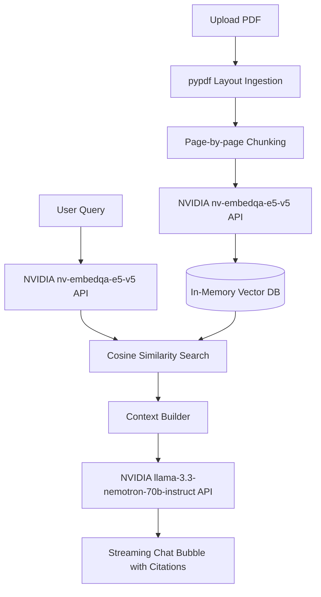

# 📄 Intelligent Document Processing (IDP) with Nemotron RAG

A modern, high-fidelity web application and dashboard for **Intelligent Document Processing (IDP)** utilizing **NVIDIA Nemotron** models for Retrieval-Augmented Generation (RAG). 

This project integrates a FastAPI backend, an in-memory vector search database, and a custom glassmorphic front-end UI. It is optimized to run smoothly on macOS and other CPU/local environments by executing layout-aware PDF extraction locally and utilizing the hosted NVIDIA NIM API for heavy embedding and reasoning workloads.

---

## 🏗️ System Architecture



### 📦 Key Models & API Catalog
*   **Embeddings Model:** `nvidia/nv-embedqa-e5-v5` via NVIDIA NIM (optimized text/passage embedding search).
*   **Reasoning Model:** `nvidia/llama-3.3-nemotron-70b-instruct` via NVIDIA NIM (generates grounded, citation-backed answers with strict format verification).

---

## 🔧 Installation & Setup

### 1. Prerequisite Python Environment
Create and activate the virtual environment:

```bash
# Create venv
python3 -m venv venv

# Activate venv
source venv/bin/activate

# Install dependencies
pip install -r requirements.txt
```

### 2. Configure NVIDIA Credentials
Register or log in at the [NVIDIA API Catalog](https://build.nvidia.com/) to fetch a free `NVIDIA_API_KEY` (starting with `nvapi-`).

You can configure this key in two ways:
1.  **System Environment variable:**
    ```bash
    export NVIDIA_API_KEY="nvapi-..."
    ```
2.  **Web Interface Settings:** Open the app and paste the API Key directly into the **Credentials** settings box in the sidebar.

### 3. Run the Server
Launch the FastAPI uvicorn server:

```bash
uvicorn app:app --reload
```

Once running, navigate to:
👉 **[http://localhost:8000](http://localhost:8000)** in your web browser.

---

## 🌟 Visual & Technical Features

*   **Multimodal RAG citations:** When you query document pages, the model returns bracketed citations matching source indices (e.g. `[1]`, `[2]`).
*   **Verified Sources Inspection:** Clicking on citation tags dynamically pops up a detailed panel highlighting the exact paragraph snippet, source document name, and page number retrieved.
*   **Dark Glassmorphic UI:** Smooth visual elements styled with CSS blurs, radial glowing neon accents, and interactive drag-and-drop ingestion cards.
*   **Persistent Vector Index:** Chunks are saved locally to `vector_db.json` so you don't need to re-index documents across server restarts.
